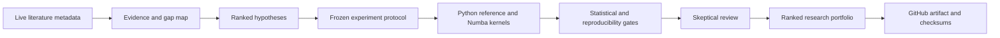

# Industrial Research Automation Lab

[](https://github.com/net421/industrial-risk-control/actions/workflows/ci.yml)
[](https://github.com/net421/industrial-risk-control/actions/workflows/codeql.yml)
[](https://github.com/net421/industrial-risk-control/actions/workflows/vertical-cycle.yml)

A reproducible research-engineering portfolio project for near-critical industrial
stochastic systems. It combines deterministic Monte Carlo experiments, exact
Python-versus-Numba validation, checkpointed batch execution, statistical
uncertainty, CI/CD, artifact integrity, and Linux deployment examples.

The current prototype also executes a small evidence-linked research cycle:
live literature retrieval, candidate-gap mapping, hypothesis ranking, frozen
experiment design, deterministic simulation, validation, skeptical review, and
a ranked portfolio decision.

## Current Version

The repository now provides a working vertical slice from literature metadata to
computational evidence:

1. Retrieve and deduplicate live scholarly records through OpenAlex.
2. Preserve DOI, source, author, year, query, and OpenAlex provenance.
3. Detect candidate gaps using transparent evidence signals.
4. Rank falsifiable hypotheses within the industrial-risk domain.
5. Freeze the selected claim, metric, seeds, comparison, and promotion rule.
6. Run deterministic Python/Numba pilot experiments.
7. Check independent seeds, uncertainty, reference agreement, and replay.
8. Produce a claim-evidence matrix, skeptical review, portfolio decision,
   manifest, and SHA-256 checksums.

The first hosted cycle screened 12 records and selected a near-critical
disruption-amplification hypothesis. Its pilot showed positive adjacent
collapse-risk differences across two independent seeds. This is preliminary
evidence for a confirmatory run, not proof of novelty or a publication-ready
result.

## What It Demonstrates

- Python packaging and command-line interfaces
- NumPy and Numba performance engineering
- Reference implementation and invariant testing
- Deterministic seed hierarchies and resumable computation
- GitHub Actions CI, scheduled smoke validation, manual full runs, and releases
- SHA-256 manifests and compact CSV/JSON/Markdown artifacts
- Ubuntu provisioning through shell and Ansible examples
- Clear separation between engineering validation and scientific claims

## Architecture



AI-assisted reasoning is intended for synthesis, hypothesis development,
criticism, and writing. Deterministic Python programs own computation,
statistics, manifests, and validation. Human approval remains required before
expensive runs, releases, or publication decisions.

## Run Locally

```bash
python -m venv .venv
source .venv/bin/activate
python -m pip install -e ".[dev]"
pytest -q
python -m industrial_research_lab.cli --profile ci --output artifacts/ci-local --fresh
python scripts/validate_portfolio_run.py --run-dir artifacts/ci-local
```

On Windows PowerShell, activate with `.venv\Scripts\Activate.ps1`.

Run the evidence-linked vertical cycle:

```bash
python scripts/run_vertical_cycle.py \
  --output-root artifacts/vertical-cycle \
  --max-literature-items 12 \
  --pilot-profile smoke \
  --fresh
python scripts/validate_vertical_cycle.py --run-dir artifacts/vertical-cycle
```

This command requires internet access for OpenAlex retrieval. The same cycle can
be launched manually through the `Evidence-Linked Vertical Cycle` GitHub Actions
workflow.

## Profiles

| Profile | Purpose | Trigger | Workload rule |
|---|---|---|---|
| `ci` | Pull-request gate | Every push/PR | Fixed, under a few minutes |
| `smoke` | Integration proof | Manual | Fixed pilot and replication |
| `cloud-proof` | Hosted/server proof | Manual only | Ten-minute bounded default |
| `full` | Portfolio-scale proof | Manual only | Up to 90 minutes, checkpointed |

Run the bounded full profile:

```bash
python -m industrial_research_lab.cli --profile full --max-minutes 90 \
  --output artifacts/full-local-proof --fresh
```

Re-run the same command without `--fresh` to resume its checkpoint.

## Baseline Result

The preserved infrastructure microcycle passed exact reference/Numba agreement,
fixed-seed replay, uncertainty reporting, and independent-seed confirmation.
Its scientific status remains preliminary and non-publishable; the repository is
primarily an engineering and reproducibility demonstration.

## Planned Development

### Next Version

- Broader literature retrieval with query logs, deduplication, and relevance
  evaluation across multiple scholarly sources.
- Abstract and legally accessible full-text synthesis rather than title-only
  signals.
- Evidence-linked hypothesis generation instead of a fixed candidate template.
- Automated experiment construction for more than one model family.
- Confirmatory parameter sweeps, sensitivity analysis, effect sizes, and
  independent implementation checks.

### Research Factory Target

- Route bounded workloads between local CPU, GitHub Actions, and an approved
  cloud or self-hosted worker.
- Reject weak hypotheses independently while allowing the portfolio cycle to
  continue.
- Generate traceable tables, figures, limitations, and manuscript candidates
  only from validated evidence.
- Compare paper opportunities by novelty, evidence strength, reproducibility,
  industrial relevance, and journal fit.
- Maintain human gates for compute budgets, novelty claims, repository releases,
  and submission decisions.

The intended final system is a semi-autonomous research assistant, not an
unsupervised paper generator. Every promoted claim should remain traceable to
verified literature, a frozen protocol, reproducible computation, statistical
uncertainty, and explicit limitations.

See [Architecture](docs/ARCHITECTURE.md),
[Reproducibility](docs/REPRODUCIBILITY.md),
[CI/CD](docs/CI_CD.md), and the [CV project summary](docs/CV_PROJECT_SUMMARY.md).
The evidence/status boundary is recorded in [AUTOMATION_PROOF.md](AUTOMATION_PROOF.md).

## Scope Boundary

This repository contains only industrial stochastic-systems research. The
separate doctrinal-text factory is intentionally excluded.
