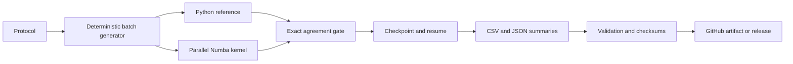

# Industrial Research Automation Lab

[](https://github.com/net421/industrial-risk-control/actions/workflows/ci.yml)
[](https://github.com/net421/industrial-risk-control/actions/workflows/codeql.yml)

A reproducible research-engineering portfolio project for near-critical industrial
stochastic systems. It combines deterministic Monte Carlo experiments, exact
Python-versus-Numba validation, checkpointed batch execution, statistical
uncertainty, CI/CD, artifact integrity, and Linux deployment examples.

## What It Demonstrates

- Python packaging and command-line interfaces
- NumPy and Numba performance engineering
- Reference implementation and invariant testing
- Deterministic seed hierarchies and resumable computation
- GitHub Actions CI, scheduled smoke validation, manual full runs, and releases
- SHA-256 manifests and compact CSV/JSON/Markdown artifacts
- Ubuntu provisioning through shell and Ansible examples
- Clear separation between engineering validation and scientific claims

## Architecture



## Run Locally

```bash
python -m venv .venv
source .venv/bin/activate
python -m pip install -e ".[dev]"
pytest -q
python -m industrial_research_lab.cli --profile ci --output artifacts/ci-local --fresh
python scripts/validate_portfolio_run.py --run-dir artifacts/ci-local
```

On Windows PowerShell, activate with `.venv\Scripts\Activate.ps1`.

## Profiles

| Profile | Purpose | Trigger | Workload rule |
|---|---|---|---|
| `ci` | Pull-request gate | Every push/PR | Fixed, under a few minutes |
| `smoke` | Integration proof | Manual | Fixed pilot and replication |
| `cloud-proof` | Hosted/server proof | Manual only | Ten-minute bounded default |
| `full` | Portfolio-scale proof | Manual only | Up to 90 minutes, checkpointed |

Run the bounded full profile:

```bash
python -m industrial_research_lab.cli --profile full --max-minutes 90 \
  --output artifacts/full-local-proof --fresh
```

Re-run the same command without `--fresh` to resume its checkpoint.

## Baseline Result

The preserved infrastructure microcycle passed exact reference/Numba agreement,
fixed-seed replay, uncertainty reporting, and independent-seed confirmation.
Its scientific status remains preliminary and non-publishable; the repository is
primarily an engineering and reproducibility demonstration.

See [Architecture](docs/ARCHITECTURE.md),
[Reproducibility](docs/REPRODUCIBILITY.md),
[CI/CD](docs/CI_CD.md), and the [CV project summary](docs/CV_PROJECT_SUMMARY.md).
The evidence/status boundary is recorded in [AUTOMATION_PROOF.md](AUTOMATION_PROOF.md).

## Scope Boundary

This repository contains only industrial stochastic-systems research. The
separate doctrinal-text factory is intentionally excluded.
